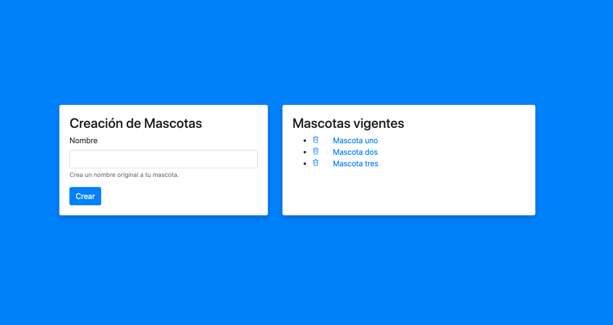

  

## Workshop 4Geeks Academy

## Ejercicio

- Crearemos un layout como el de la imagen usando bootstrap

- Los datos ingresados en el formulario se almacenarán en un array

- Listaremos los elementos del Array

- Eliminaremos elementos del Array
